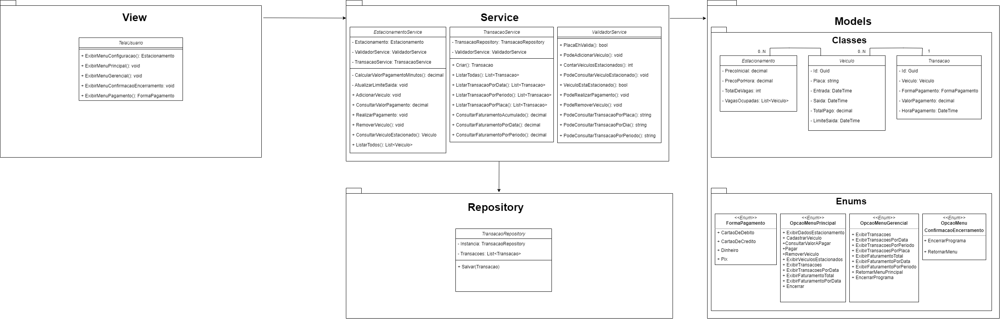
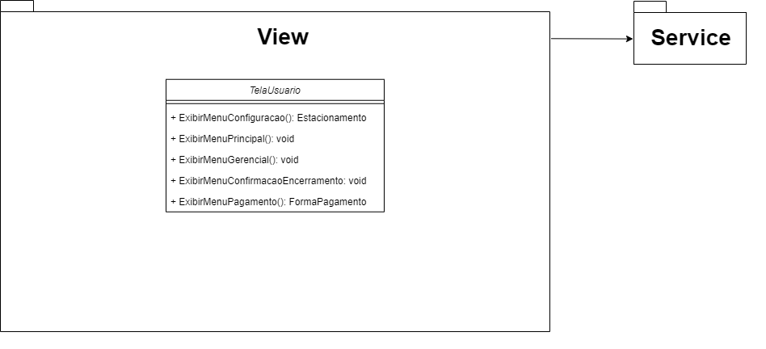
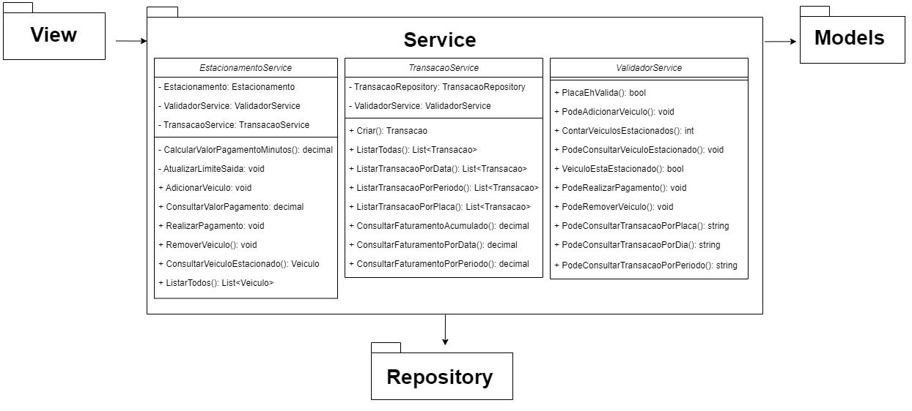
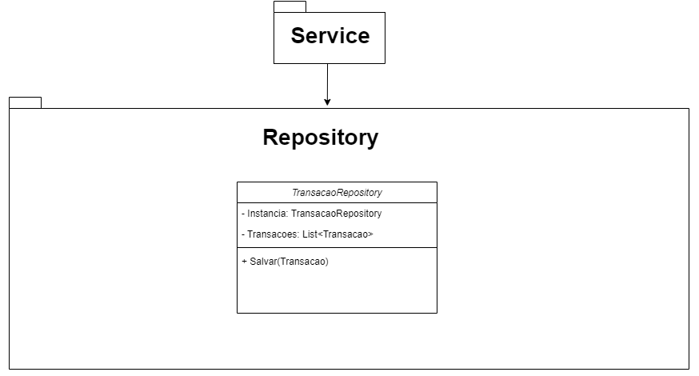
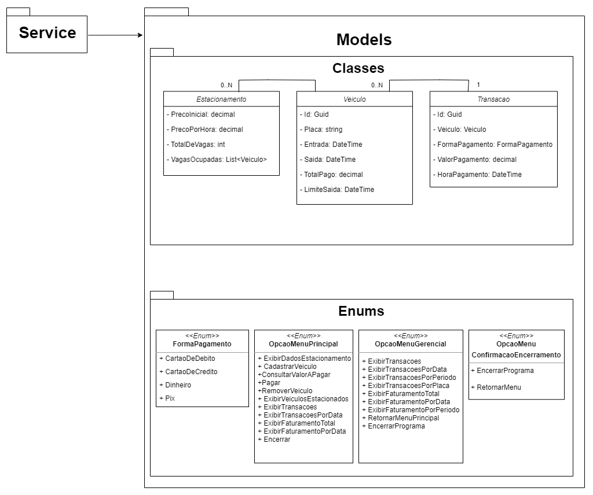

# AVA SHOPPING PARKING

AvaShoppingPark é um sistema de gerenciamento de estacionamento de um shopping desenvolvido em C#.

Serão solicitados ao usuário dados para configurar o estacionamento como: a quantidade de vagas a serem disponibilizadas e os preços da 1ª hora e das horas adicionais. Neste sistema o pagamento deve ser realizado antes da remoção do veículo, que estará condicionada ao horário limite de saída. 
Cada veículo possui um limite de tolerância de permanência de 20 minutos a partir da sua entrada, não sendo necessário realizar pagamento neste período. Caso a permanência no estacionamento exceda o tempo de 20 minutos, deverá realizar o pagamento referente ao tempo estacionado, que é cobrado pela 1ª hora + hora ou fração adicional.
Após o pagamento, o horário de limite de saída será atualizado, garantindo uma tolerância de saída mínima de 15 minutos para que o veículo tenha tempo hábil de se locomover até a cancela. Desta forma, caso o pagamento seja feito a menos de 15 minutos até a cobrança da próxima hora, o limite de saída será acrescido de tempo adicional até completar os 15 minutos necessários.

## Diagrama de Classes:

## Funcionalidades:
### Menu Principal:
- Exibir dados do estacionamento
- Estacionar Veículo
- Consultar Valor a pagar
- Pagar
- Remover Veículo
- Listar veículos Estacionados

### Menu Gerencial:
- **Listar Transacoes**: exibe todas as transações realizadas;
- **Listar Transacoes Por Data**: solicita uma data e exibe as trasações realizadas na data informada;
- **Listar Transacoes Por Periodo**: solicita um período (datas inicial e final) e exibe as trasações realizadas no período informado;
- **Listar Transacoes Por Placa**: solicita uma placa e exibe as trasações realizadas para placa informada;
- **Consultar Faturamento Total**: exibe a soma dos valores pagos em todas as transações;
- **Consultar Faturamento Por Data**: solicita uma data e exibe a soma dos valores pagos na data informada;
- **Consultar Faturamento Por Periodo**: solicita um período (datas inicial e final) e exibe a soma dos valores pagos no período informado;

## Instalando o Sistema
### Requisitos:
- NET6.0 (Caso não possua, link para download: [.NET 6.0](https://dotnet.microsoft.com/pt-br/download/dotnet/6.0);
- IDE ou Editor de Texto que suporte .NET

### Clone o repositório:
- git clone https://github.com/walkiriatorres/AvaShoppingParking.git

### Acesse o Diretório:
- cd DesafioFundamentos

### Execute o programa:
- dotnet run